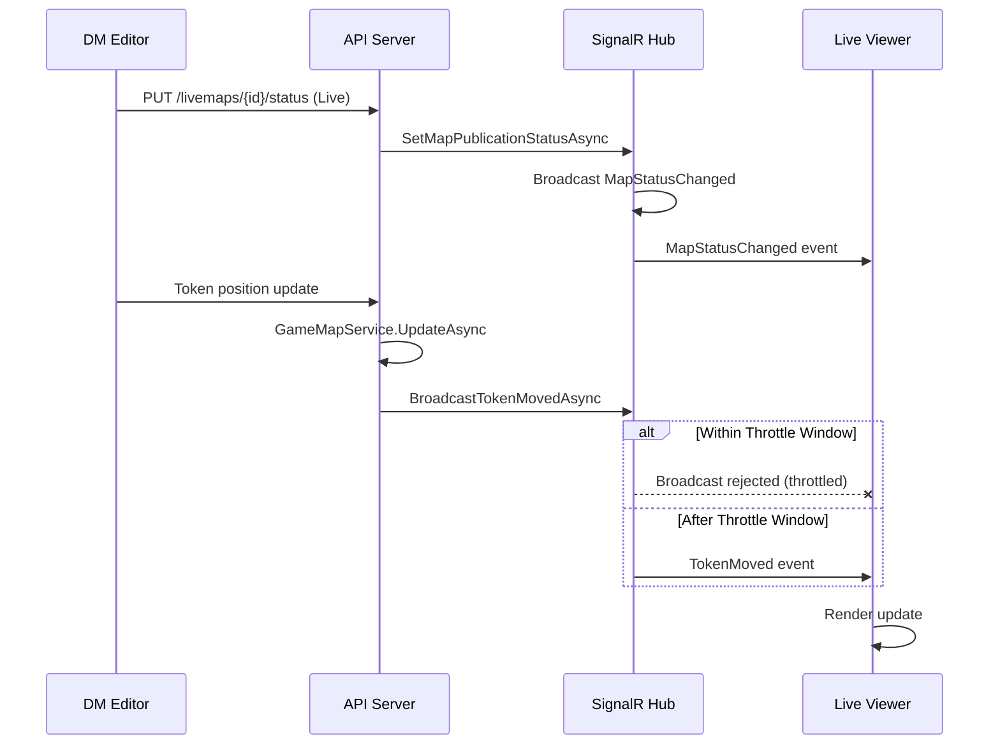

# D&D Map Builder - Live Map API Documentation

## Overview

The Live Map API enables real-time display of game maps on a separate screen (TV/projector) during tabletop RPG sessions. The Dungeon Master (DM) can control which maps are broadcast to live viewers using a combination of REST endpoints and SignalR WebSocket connections.

**Key Features:**
- Real-time synchronization of map updates via SignalR WebSockets
- Publication status control (Draft/Live) for selective broadcasting
- Token movement and state tracking
- Zero-latency map state snapshots for new connections
- Configurable broadcast throttling to prevent network saturation
- Full authorization enforcement at both REST and WebSocket layers

**Architecture:** The feature uses clean architecture with SignalR for bidirectional real-time communication and REST endpoints for state management. All operations require JWT authentication.

---

## Authentication

### JWT Bearer Token

All API endpoints and SignalR connections require a valid JWT Bearer token. The token must be obtained through the authentication system.

#### Obtaining a Token

```bash
curl -X POST https://api.example.com/api/v1/auth/login \
  -H "Content-Type: application/json" \
  -d '{
    "email": "dm@example.com",
    "password": "secure_password"
  }'
```

**Response:**
```json
{
  "success": true,
  "data": {
    "token": "eyJhbGciOiJIUzI1NiIsInR5cCI6IkpXVCJ9...",
    "expiresIn": 1440,
    "user": {
      "id": "user123",
      "email": "dm@example.com",
      "name": "Dungeon Master"
    }
  },
  "message": "Login successful."
}
```

**Token Lifetime:** 24 hours (1440 minutes) by default. Tokens expire and must be refreshed before use.

#### Using the Token

**In REST Endpoints:**
```
Authorization: Bearer {token}
```

**In SignalR Connections:**
Pass the token as a query string parameter:
```
wss://api.example.com/hubs/gamemap?access_token={token}
```

---

## REST Endpoints

### 1. Set Publication Status

**Endpoint:** `PUT /api/v1/livemaps/{mapId}/status`

**Description:** Change the publication status of a map between Draft and Live. Only Live maps broadcast updates to connected clients. Setting a map to Live triggers a broadcast of the status change to all connected subscribers.

**Authentication:** Required (Bearer Token)

**Path Parameters:**
| Parameter | Type | Description |
|-----------|------|-------------|
| `mapId` | string | UUID of the map to update |

**Request Body:**
```json
{
  "status": "Live"
}
```

**Status Values:**
- `Draft` (0) - Map is not broadcast to live viewers
- `Live` (1) - Map is broadcast in real-time to all connected clients

**Success Response (200 OK):**
```json
{
  "success": true,
  "data": true,
  "message": "Publication status updated."
}
```

**Error Responses:**
- **401 Unauthorized** - Missing or invalid token
- **403 Forbidden** - User does not own the campaign containing this map
- **404 Not Found** - Map does not exist

**Example Request:**
```bash
curl -X PUT https://api.example.com/api/v1/livemaps/map-uuid-123/status \
  -H "Authorization: Bearer YOUR_TOKEN" \
  -H "Content-Type: application/json" \
  -d '{"status": "Live"}'
```

**Broadcast Event:** When status changes to `Live`, all connected clients receive:
```json
{
  "mapId": "map-uuid-123",
  "newStatus": "Live",
  "timestamp": "2026-01-27T21:30:45.123Z"
}
```

---

### 2. Get Map State Snapshot

**Endpoint:** `GET /api/v1/livemaps/{mapId}/snapshot`

**Description:** Retrieve the current state of a Live map including all tokens and their positions. Returns `null` for Draft maps. This endpoint is used when a new client connects to obtain the initial map state.

**Authentication:** Required (Bearer Token)

**Path Parameters:**
| Parameter | Type | Description |
|-----------|------|-------------|
| `mapId` | string | UUID of the map |

**Success Response (200 OK):**
```json
{
  "success": true,
  "data": {
    "map": {
      "id": "map-uuid-123",
      "name": "Tavern Battle Map",
      "imageUrl": "https://cdn.example.com/maps/tavern.jpg",
      "rows": 20,
      "cols": 20,
      "gridColor": "#000000",
      "gridOpacity": 0.3,
      "publicationStatus": "Live",
      "tokens": [
        {
          "id": "token-instance-1",
          "tokenId": "goblin-token",
          "x": 5,
          "y": 7,
          "createdAt": "2026-01-27T21:00:00Z"
        },
        {
          "id": "token-instance-2",
          "tokenId": "player-paladin",
          "x": 10,
          "y": 10,
          "createdAt": "2026-01-27T21:00:00Z"
        }
      ],
      "createdAt": "2026-01-27T20:00:00Z",
      "updatedAt": "2026-01-27T21:30:00Z"
    },
    "timestamp": "2026-01-27T21:30:45.123Z"
  }
}
```

**Error Responses:**
- **401 Unauthorized** - Missing or invalid token
- **404 Not Found** - Map not found, does not exist, or is not Live

**Example Request:**
```bash
curl -X GET https://api.example.com/api/v1/livemaps/map-uuid-123/snapshot \
  -H "Authorization: Bearer YOUR_TOKEN"
```

**Response Time:** Typically < 50ms. Ideal for fetching initial state on client connection.

---

## SignalR Hub: GameMapHub

**Endpoint:** `wss://api.example.com/hubs/gamemap`

The GameMapHub handles real-time bidirectional communication for live map updates. Clients connect, authenticate, and join map-specific groups to receive targeted broadcasts.

### Connection & Disconnection

#### Establish Connection

**JavaScript Example:**
```javascript
import * as signalR from "@microsoft/signalr";

const token = localStorage.getItem('authToken'); // From login response

const connection = new signalR.HubConnectionBuilder()
  .withUrl(`${WS_URL}/hubs/gamemap?access_token=${token}`, {
    skipNegotiation: true,
    transport: signalR.HttpTransportType.WebSockets
  })
  .withAutomaticReconnect({
    nextRetryDelayInMilliseconds: retryCount => {
      // Exponential backoff: 1s, 2s, 4s, 8s, 10s...
      return Math.min(1000 * Math.pow(2, retryCount), 10000);
    }
  })
  .build();

await connection.start();
console.log('Connected to GameMapHub');
```

**Connection Lifecycle Events:**
```javascript
// Successful connection
connection.on('connection', () => {
  console.log('Connected');
});

// Disconnected
connection.onclose(() => {
  console.log('Disconnected');
});

// Connection error
connection.onreconnecting((error) => {
  console.error('Reconnecting...', error);
});

connection.onreconnected(() => {
  console.log('Reconnected');
});
```

---

### Hub Methods (Client → Server)

#### JoinMapGroup

**Method:** `connection.invoke("JoinMapGroup", mapId)`

**Description:** Subscribe to updates for a specific map. Client will receive all broadcasts for that map (MapUpdated, TokenMoved, TokenAdded, TokenRemoved, MapStatusChanged).

**Parameters:**
| Parameter | Type | Description |
|-----------|------|-------------|
| `mapId` | string | UUID of the map to subscribe to |

**Returns:** `Promise<void>`

**Authorization:** Automatically verified - user must own the campaign containing the map or the request is rejected.

**Error Handling:**
```javascript
try {
  await connection.invoke("JoinMapGroup", "map-uuid-123");
  console.log('Successfully joined map group');
} catch (error) {
  if (error.message.includes('access denied')) {
    console.error('You do not have permission to view this map');
  } else if (error.message.includes('not found')) {
    console.error('Map does not exist');
  } else {
    console.error('Error joining map group:', error);
  }
}
```

**Example:**
```javascript
// Join a map group
await connection.invoke("JoinMapGroup", "map-uuid-123");

// Now listen for events for this map (see section below)
```

---

#### LeaveMapGroup

**Method:** `connection.invoke("LeaveMapGroup", mapId)`

**Description:** Unsubscribe from updates for a specific map. No more events will be received for that map.

**Parameters:**
| Parameter | Type | Description |
|-----------|------|-------------|
| `mapId` | string | UUID of the map to unsubscribe from |

**Returns:** `Promise<void>`

**Example:**
```javascript
await connection.invoke("LeaveMapGroup", "map-uuid-123");
console.log('Left map group');
```

---

### Server-to-Client Events

Clients listen for these events after joining a map group. Events are broadcast only for Live maps.

#### MapUpdated

**Event:** `connection.on("MapUpdated", (event) => { })`

**Description:** Fired when map properties are updated (name, grid settings, image, dimensions).

**Event Data:**
```javascript
{
  "mapId": "map-uuid-123",
  "name": "Tavern Battle Map",
  "rows": 20,
  "cols": 20,
  "gridColor": "#000000",
  "gridOpacity": 0.3,
  "imageUrl": "https://cdn.example.com/maps/tavern.jpg",
  "timestamp": "2026-01-27T21:30:45.123Z"
}
```

**Example Handler:**
```javascript
connection.on("MapUpdated", (event) => {
  console.log(`Map ${event.mapId} updated:`, event.name);

  // Update your map display
  updateMapDisplay({
    name: event.name,
    rows: event.rows,
    cols: event.cols,
    gridColor: event.gridColor,
    gridOpacity: event.gridOpacity,
    imageUrl: event.imageUrl
  });
});
```

---

#### TokenMoved

**Event:** `connection.on("TokenMoved", (event) => { })`

**Description:** Fired when a token moves to a new position. This is the most frequent event during gameplay.

**Event Data:**
```javascript
{
  "mapId": "map-uuid-123",
  "tokenInstanceId": "token-instance-1",
  "x": 7,
  "y": 9,
  "timestamp": "2026-01-27T21:30:47.234Z"
}
```

**Performance Note:** Token movement events are throttled (default: 100ms between broadcasts). Rapid movements are batched to prevent network saturation. The live view will see smooth animation by interpolating between positions.

**Example Handler:**
```javascript
connection.on("TokenMoved", (event) => {
  // Update token position in your UI
  const token = document.getElementById(`token-${event.tokenInstanceId}`);
  if (token) {
    token.style.gridColumn = event.x;
    token.style.gridRow = event.y;
    // Or animate: token.animate([...], {...});
  }
});
```

---

#### TokenAdded

**Event:** `connection.on("TokenAdded", (event) => { })`

**Description:** Fired when a new token is placed on the map.

**Event Data:**
```javascript
{
  "mapId": "map-uuid-123",
  "tokenInstanceId": "token-instance-3",
  "tokenId": "monster-ghoul",
  "x": 15,
  "y": 12,
  "timestamp": "2026-01-27T21:31:00.345Z"
}
```

**Example Handler:**
```javascript
connection.on("TokenAdded", (event) => {
  // Add token to map
  addTokenToMap({
    id: event.tokenInstanceId,
    tokenId: event.tokenId,
    x: event.x,
    y: event.y
  });
});
```

---

#### TokenRemoved

**Event:** `connection.on("TokenRemoved", (event) => { })`

**Description:** Fired when a token is removed from the map.

**Event Data:**
```javascript
{
  "mapId": "map-uuid-123",
  "tokenInstanceId": "token-instance-1",
  "timestamp": "2026-01-27T21:31:05.456Z"
}
```

**Example Handler:**
```javascript
connection.on("TokenRemoved", (event) => {
  // Remove token from map
  removeTokenFromMap(event.tokenInstanceId);
});
```

---

#### MapStatusChanged

**Event:** `connection.on("MapStatusChanged", (event) => { })`

**Description:** Fired when map publication status changes (Draft ↔ Live).

**Event Data:**
```javascript
{
  "mapId": "map-uuid-123",
  "newStatus": "Live",
  "timestamp": "2026-01-27T21:31:10.567Z"
}
```

**Example Handler:**
```javascript
connection.on("MapStatusChanged", (event) => {
  if (event.newStatus === "Live") {
    console.log("Map is now Live - broadcasting to viewers");
    showLiveIndicator();
  } else {
    console.log("Map is now Draft - no longer broadcasting");
    hideLiveIndicator();
  }
});
```

---

## Complete Integration Example

### Minimal Live Map Viewer

```javascript
import * as signalR from "@microsoft/signalr";

class LiveMapViewer {
  constructor(containerElement, apiUrl, wsUrl) {
    this.container = containerElement;
    this.apiUrl = apiUrl;
    this.wsUrl = wsUrl;
    this.connection = null;
    this.tokens = new Map();
  }

  async connect(token, mapId) {
    // Establish WebSocket connection
    this.connection = new signalR.HubConnectionBuilder()
      .withUrl(`${this.wsUrl}/hubs/gamemap?access_token=${token}`, {
        skipNegotiation: true,
        transport: signalR.HttpTransportType.WebSockets
      })
      .withAutomaticReconnect()
      .build();

    // Setup event handlers
    this.setupEventHandlers();

    // Start connection
    await this.connection.start();
    console.log('Connected to live map hub');

    // Join the map group
    await this.connection.invoke("JoinMapGroup", mapId);

    // Fetch initial state
    await this.loadInitialMapState(token, mapId);
  }

  setupEventHandlers() {
    this.connection.on("MapUpdated", (event) => {
      console.log("Map updated:", event.name);
      this.updateMapDisplay(event);
    });

    this.connection.on("TokenMoved", (event) => {
      this.updateTokenPosition(event.tokenInstanceId, event.x, event.y);
    });

    this.connection.on("TokenAdded", (event) => {
      this.addToken(event.tokenInstanceId, event.tokenId, event.x, event.y);
    });

    this.connection.on("TokenRemoved", (event) => {
      this.removeToken(event.tokenInstanceId);
    });

    this.connection.on("MapStatusChanged", (event) => {
      console.log("Map status changed to:", event.newStatus);
    });
  }

  async loadInitialMapState(token, mapId) {
    const response = await fetch(`${this.apiUrl}/api/v1/livemaps/${mapId}/snapshot`, {
      headers: { 'Authorization': `Bearer ${token}` }
    });

    if (!response.ok) {
      throw new Error('Failed to load initial map state');
    }

    const result = await response.json();
    const snapshot = result.data;

    // Render map
    this.updateMapDisplay(snapshot.map);

    // Render tokens
    for (const token of snapshot.map.tokens) {
      this.addToken(token.id, token.tokenId, token.x, token.y);
    }
  }

  updateMapDisplay(mapData) {
    this.container.innerHTML = `
      <div class="map-container" style="
        display: grid;
        grid-template-columns: repeat(${mapData.cols}, 1fr);
        grid-template-rows: repeat(${mapData.rows}, 1fr);
        gap: 1px;
        background: url('${mapData.imageUrl}');
        background-size: cover;
      ">
        <div class="grid-overlay" style="
          position: absolute;
          width: 100%;
          height: 100%;
          border: 1px solid ${mapData.gridColor};
          opacity: ${mapData.gridOpacity};
        "></div>
      </div>
    `;
  }

  addToken(tokenInstanceId, tokenId, x, y) {
    const token = document.createElement('div');
    token.id = `token-${tokenInstanceId}`;
    token.className = 'token';
    token.style.cssText = `
      grid-column: ${x};
      grid-row: ${y};
      background: url('/tokens/${tokenId}.png');
      background-size: contain;
    `;
    this.container.appendChild(token);
    this.tokens.set(tokenInstanceId, { x, y });
  }

  updateTokenPosition(tokenInstanceId, x, y) {
    const token = document.getElementById(`token-${tokenInstanceId}`);
    if (token) {
      token.style.gridColumn = x;
      token.style.gridRow = y;
      this.tokens.set(tokenInstanceId, { x, y });
    }
  }

  removeToken(tokenInstanceId) {
    const token = document.getElementById(`token-${tokenInstanceId}`);
    if (token) {
      token.remove();
      this.tokens.delete(tokenInstanceId);
    }
  }

  async disconnect() {
    if (this.connection) {
      await this.connection.stop();
    }
  }
}

// Usage:
const viewer = new LiveMapViewer(
  document.getElementById('map-display'),
  'https://api.example.com',
  'wss://api.example.com'
);

const token = localStorage.getItem('authToken');
const mapId = 'map-uuid-123';

await viewer.connect(token, mapId);
```

---

## Data Structures (DTOs)

### GameMapDto

Represents a complete map with all properties and tokens.

```typescript
{
  "id": string;              // UUID
  "name": string;            // Display name
  "imageUrl": string | null; // Background image URL
  "rows": number;            // Grid rows (e.g., 20)
  "cols": number;            // Grid columns (e.g., 20)
  "gridColor": string;       // Hex color code (e.g., "#000000")
  "gridOpacity": number;     // 0.0 to 1.0 (e.g., 0.3)
  "publicationStatus": "Draft" | "Live";
  "tokens": MapTokenInstanceDto[];
  "createdAt": ISO8601;
  "updatedAt": ISO8601;
}
```

### MapTokenInstanceDto

Represents a token placed on a map.

```typescript
{
  "id": string;              // UUID of this instance
  "tokenId": string;         // Reference to token definition
  "mapId": string;           // Parent map UUID
  "x": number;               // Column position (1-indexed)
  "y": number;               // Row position (1-indexed)
  "createdAt": ISO8601;
}
```

### MapStateSnapshot

Response from snapshot endpoint.

```typescript
{
  "map": GameMapDto;
  "timestamp": ISO8601;      // When snapshot was taken
}
```

### PublicationStatus Enum

```
Draft = 0   // Map not broadcast to live viewers
Live = 1    // Map broadcast in real-time
```

---

## Error Handling

### HTTP Error Codes

| Code | Meaning | Example |
|------|---------|---------|
| 200 | Success | Status updated, snapshot retrieved |
| 400 | Bad Request | Invalid status value |
| 401 | Unauthorized | Missing or invalid token |
| 403 | Forbidden | User doesn't own campaign |
| 404 | Not Found | Map doesn't exist |
| 500 | Server Error | Database connection failure |

### SignalR Errors

Hub method invocations throw `HubException` on failure:

```javascript
try {
  await connection.invoke("JoinMapGroup", mapId);
} catch (error) {
  // error.message contains: "Unauthorized", "Map not found or access denied", etc.
  console.error('Hub error:', error.message);
}
```

### Common Error Messages

- **"Unauthorized"** - User not authenticated or token invalid
- **"Map not found or access denied"** - Map doesn't exist or user lacks permission
- **"Unauthorized"** (on SignalR connect) - Token not in query string or invalid format

---

## Performance Considerations

### Broadcast Throttling

Token movement broadcasts are throttled to prevent overwhelming the network with frequent updates. Default throttle window: **100ms**.

- Rapid token movements (e.g., during drag) are batched
- Multiple position changes within 100ms result in a single broadcast
- After throttle window elapses, next movement is broadcast immediately
- Different maps have independent throttle windows

**Example:**
- User drags token from (5,5) → (6,5) → (7,5) → (8,5) over 200ms
- DM sends 4 updates to server
- Server throttles to: send at (6,5), wait 100ms, send at (8,5)
- Live view receives 2 updates instead of 4

**Live View Animation:**
```javascript
// Smooth interpolation between throttled updates
function animateTokenMovement(tokenId, newX, newY) {
  const token = document.getElementById(`token-${tokenId}`);
  token.animate([
    { gridColumn: currentX, gridRow: currentY },
    { gridColumn: newX, gridRow: newY }
  ], {
    duration: 100, // Match throttle window
    easing: 'ease-out'
  });
}
```

### Latency

- **REST Endpoints:** < 50ms typical response time
- **SignalR Broadcasts:** < 100ms from update to client (plus throttle window)
- **Reconnection:** Automatic with exponential backoff (1s, 2s, 4s, 8s, 10s max)

### Recommended Practices

1. **Throttle client updates** - Don't send more than 1 update per 100ms per token
2. **Batch token operations** - Update multiple tokens in single operation
3. **Unsubscribe from unused maps** - Call `LeaveMapGroup` when switching maps
4. **Handle reconnection** - Implement exponential backoff for reconnection attempts
5. **Monitor connection state** - Maintain UI indicator of connection status

---

## Broadcast Flow Diagram



---

## Troubleshooting

### Connection Issues

**Problem:** WebSocket connection fails
- **Solution:** Verify token is valid and not expired. Check CORS settings on server.

**Problem:** "Unauthorized" error on join
- **Solution:** Ensure user owns the campaign containing the map. Verify JWT token in query string.

**Problem:** No events received after joining
- **Solution:** Check that map has `publicationStatus: "Live"`. Draft maps don't broadcast.

### Real-time Sync Issues

**Problem:** Updates seem delayed
- **Solution:** This is expected due to 100ms throttle window. Add client-side animation/interpolation for smooth display.

**Problem:** Updates sometimes disappear
- **Solution:** Ensure reconnection logic is in place. Network interruptions trigger automatic reconnection.

---

## Support & Additional Resources

- **API Versioning:** All endpoints use `/api/v1/` prefix
- **Rate Limiting:** Not currently enforced; may be added in future
- **CORS:** Configured for specified origins in `appsettings.json`
- **Logging:** Server logs all broadcasts at INFO level for debugging

For issues or feature requests, contact the development team.

---

**Documentation Version:** 1.0
**Last Updated:** January 27, 2026
**API Version:** 1.0
